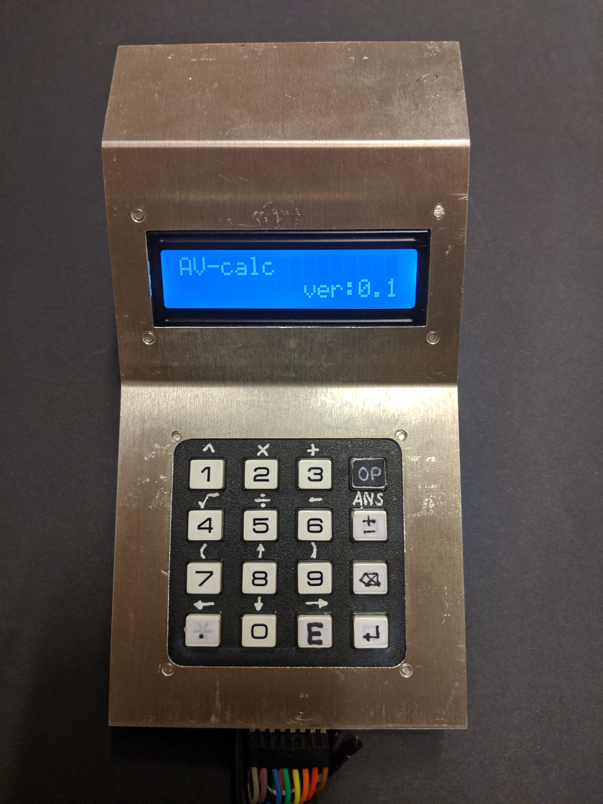
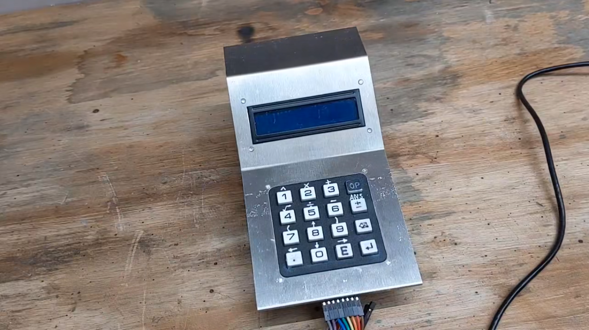
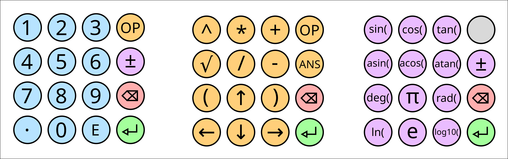
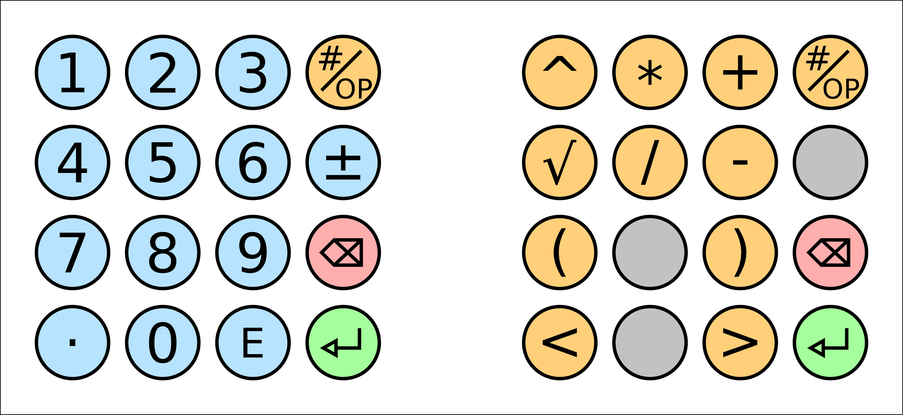
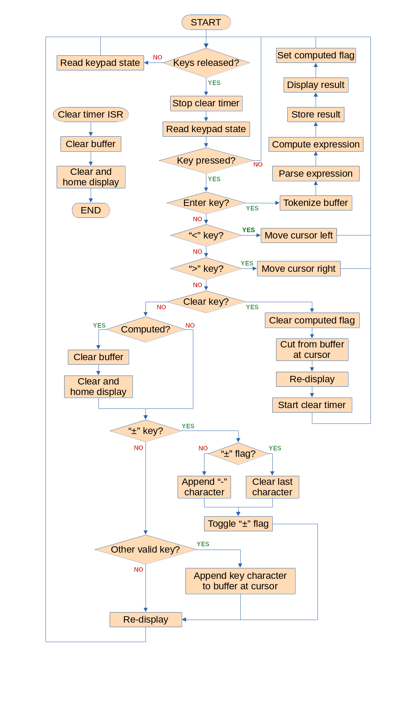
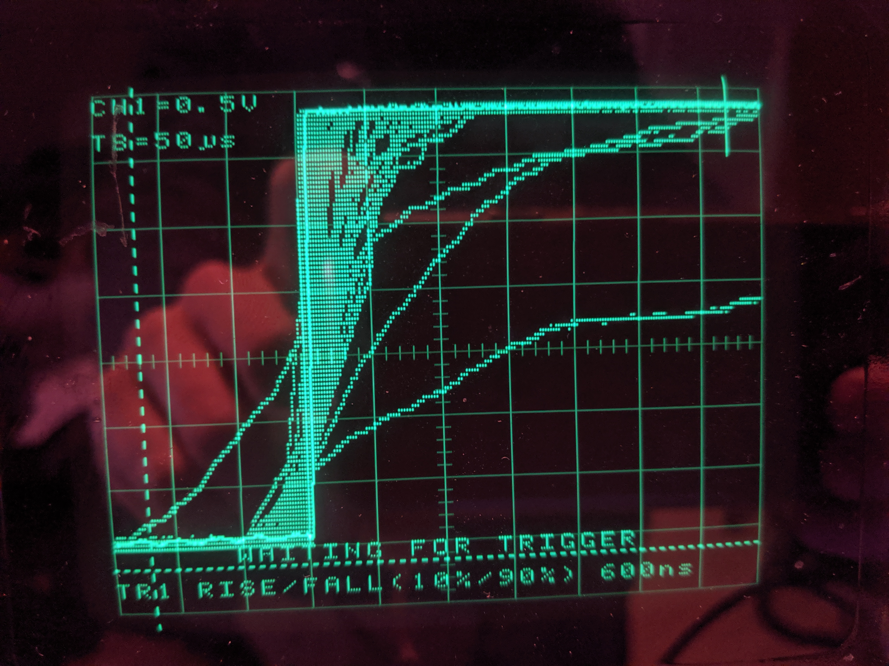

# ELEC3662 Embedded Systems Mini-project - Calculator



This software is written for the Texas Instruments EK-TM4C123GXL "LaunchPad" development board.

To build run:
-   "make"
-   "make flash"

To debug run:
-   "make debug"

To clean run:
-   "make clean"

Dependencies (Debian packages):
-   gcc-arm-none-eabi
-   lm4flash
-   openocd
-   gdb-multiarch
-   make

## Release Version 0.1 - Features

**Video:**
[]({https://leeds365-my.sharepoint.com/:v:/g/personal/el20a2v_leeds_ac_uk/ES2k76CMzHxMor4YNX60EN4BUuuVMuZcYiA4r5vyfReBnA?e=gnGobm})

My calculator provides a 256 character buffer for entering mathematical expressions, with a line editing system supporting scrolling of lines longer that the 16 character width of the display, with left and right movement of the cursor and insertion and deletion of characters from any position within the input expression. Expressions are entered using the 16-key keypad and displayed on the upper row of the LCD display. All computations are done using double precision floating point arithmetic and the results displayed on the lower row of the LCD. My calculator provides a history of previously computed expressions 64 entries long and a mechanism for including previously computed results as part of input expressions. 



The calculator keypad has three operating states; numeric entry mode, operator entry mode and extended function mode. Available in all modes are the backspace key and the enter key. The backspace key erases the character in the input expression to the left of the cursor and holding down the backspace key clears the entire expression. The enter key performs the calculation, with the result displayed on the lower row of the LCD display 

By default, the keypad is in numeric entry mode, whereby numbers can be entered into the expression buffer. In this mode the digits 0 to 9 can be entered, along with decimal point and the exponent symbol ‘E’, permitting the entry of decimal numbers and numbers in scientific notation. The ‘±’ (plus / minus) key permits the entry of negative numbers and numbers with negative exponents. It behaves as a toggle, meaning, if the cursor is on any part of a non-negative number or exponent a minus sign is added to the beginning of the number and if the cursor is on any part of a negative number or exponent the minus sign is removed from the front of that number. 

To add operators to the input expression operator mode must be used. Operator mode is accessed by holding down the “OP” key in the top right corner while pressing other keys. It permits entry of plus (‘+’), minus (‘-’), multiply (‘×’), divide (‘÷’), power (‘^’) and square root (‘√’), along with open bracket (‘(‘) and close bracket (‘)’). 

By pressing the OP key and the ± key the previously calculated answer, “ANS”,  (which has the value 0.0 at power on) can be added to the input expression. This permits the reuse of previous results in further calculations. 

The left and right arrow keys move the cursor left and right along the input expression and the up and down arrows traverse the history of previously entered expressions. If the left or right arrow key is held down it will move the cursor to the beginning or the end of the expression respectively. The up arrow goes back through the expressions and the down arrow goes forward until the most recently entered expression. If pressed again it generates a new blank expression and puts the cursor at the beginning of the line. If the down arrow is pressed prior to stepping back through the history it does nothing. 

Extended function mode permits the entry of a set of useful trigonometric functions, logarithms and some numerical constants. It is accessed by holding down the ± key, then pressing other keys. Extended function mode provides trigonometric functions sine (“sin(“), cosine (“cos(“) and tangent (“tan(“), inverse sine (“asin(“), cosine (“acos(“) and tangent (“atan(“), and conversion routines from degrees to radians (“rad(“) and radians to degrees (“deg(“). It provides the natural logarithm (“ln(“) and the base 10 logarithm (“log10(“). In addition the numeric constants π and e (Euler's number) can be entered.

## Project Highlights

**Most technically impressive features of my project:** 

-   For my calculator to compute mathematical expressions I’ve written a [recursive descent parser](https://github.com/AVatLeeds/ELEC3662-calculator-project/blob/master/recursive_descent.cpp) based on my EBNF (Extended Backus-Naur Form) specification describing expressions (extended compared to the specification presented in week 8).

    ```
    digit = ( "0" | "1" | "2" | "3" | "4" | "5" | "6" | "7" | "8" | "9" )
    integer = digit { digit }
    fraction = "." digit { digit }
    exponent = "E" [ "-" ] digit { digit }
    number = ( ( [ "-" ] integer [ fraction ] ) | ( [ "-" ] [ integer ] fraction ) ) [ exponent ]
    factor = ( [ "-" ] π ) | ( [ "-" ] e ) | ( [ "-" ] "ANS" ) | ( [ "-" ] "(" expression ")" ) | number
    trigonometric = ( [ "-" ] "sin" factor ) | ( [ "-" ] "cos" factor ) | ( [ "-" ] "tan" factor ) | ( [ "-" ] "asin" factor ) | ( [ "-" ] "acos" factor ) | ( [ "-" ] "atan" factor ) | ( [ "-" ] "deg" factor ) | ( [ "-" ] "rad" factor )
    logarithm = ( [ "-" ] "ln" factor ) | ( [ "-" ] "log10" factor )
    special = trigonometric | logarithm | factor
    power = ( [ "-" ] "√" special ) | ( special "^" special )
    term = power [ "x" | "÷" ] power
    expression = term [ "+" | "-" ] term.
    ```

    This parser guarantees correct operator precedence. It supports powers and roots, unary minus and mathematical functions (like sine and cosine). It supports arbitrarily nested expressions and allows the previous result to be included in expressions. As part of writing the parser I also wrote a [custom string to number conversion routine](https://github.com/AVatLeeds/ELEC3662-calculator-project/blob/636c7f1b11cd13e7094c1246c4add7f16925324d/recursive_descent.cpp#L35). This was necessary due to a limitation of standard library function “strtod”, whereby hexadecimal numbers prefixed with “0x” are valid numbers, causing parsing to fail where multiplications by zero were encountered. 

- For my calculator to display results I have written a routine to [convert double precision floating point values to an ascii string](https://github.com/AVatLeeds/ELEC3662-calculator-project/blob/636c7f1b11cd13e7094c1246c4add7f16925324d/calculator.cpp#L502). I am fully aware that standard library utilities such as sprintf and snprintf already exist for this task. I chose to write my own since I am using the reduced size implementation of the standard library (g++ flag –specs=nano.specs), where sprintf doesn’t support floating point conversion. Besides, the use of snprintf inflates the size of the compiled binary by over 40%! (31kB to 53kB), which I find to be unacceptable. My implementation is far more compact, implements only the features that I need and has allowed me to learn a considerable amount about the structure and the use of the IEEE 754 floating point format ([Standard](https://ieeexplore.ieee.org/stamp/stamp.jsp?tp=&arnumber=8766229)). 

- I have implemented the build and debug toolchain for my calculator software, and implemented the [run-time environment](https://github.com/AVatLeeds/ELEC3662-calculator-project/blob/master/TM4C123GXL_RTE.c) that performs all the preliminary setup steps before calling the “main()” entry point of my program. To do this I have used GNU make and GNU linker scripts. To upload the compiled binary of my program to the launchpad development board I am using an open-source utility called [lm4flash](https://github.com/utzig/lm4tools). I have been able to setup hardware debugging within my text editor using the GNU debugger (GDB) and the open on-chip debugger ([OpenOCD](https://openocd.org/)). This allows me to set breakpoints from within the editor and single step through my program, with the capacity to inspect variables and the contents of registers. This has been a very powerful capability while developing my software. I have chosen to develop my project this way as the ARM Keil IDE is not available on Linux. Additionally, it obscures aspects of the development process (i.e. the runtime environment and start up files) that I believe are critical for a competent embedded systems engineer to understand. 

- I have written an advanced line editing system within my calculator class that provides methods for insertion and deletion of characters and text from the expression buffer, movement of the cursor and scrolling of overly long lines. The sign toggling functionality is intelligent enough to determine what part of a number or function name the cursor is in and place or remove the minus sign accordingly. The backspace functionality works similarly. 

**The software development techniques that I have used to achieve the above features include:** 

-   Specification of grammars using extended Backus-Naur form.
-   The technique of recursive descent parsing.
-   Finite state machines for ASCII to number conversion.
-   Version control using Git. All sourcecode available on Github https://github.com/AVatLeeds/ELEC3662-calculator-project.
-   Object oriented design.
-   On chip debugging, using OpenOCD and GDB. 
-   Development of a build system using GNU Make and the GNU ARM C and C++ compilers and associated tools. 
-   Development of a hardware abstraction layer, [using C structs to represent memory layout of microcontroller peripherals](https://github.com/AVatLeeds/ELEC3662-calculator-project/blob/636c7f1b11cd13e7094c1246c4add7f16925324d/GPIO.h#L6). 
-   Use of the “math” library. 

**Most creative and innovative aspects of my project:** 

-   I designed my keypad driver class to support arbitrary combinations of keypresses. This has allowed me to use the keypad in a multi-mode way. By setting up specific keys as modifiers I have been able to provide 40 different functions using only 16 keys. With so many different key combinations I’ve been able to add extra useful functions to my calculator like trigonometric functions, logarithms and numerical constants. To achieve this feature my keypad driver encodes the state of each key, pressed or not pressed, as one bit of a 16-bit number, so each combination of keys pressed will generate a unique number (the driver handles ambiguous cases as described in a previous diary entry). In my main program a switch statement is then used to call individual methods of the calculator class based on the state of the keypad. This switch statement is complicated somewhat by the fact that I have chosen to use the ± key as an additional modifier. This is made possible by having this key perform the sign toggling action when released rather than pressed. If it is pressed and then another key is pressed it performs the extended function instead. To prevent a key press event from occurring repeatedly the “pressed” flag is set whenever a key is pressed. The flag is only cleared when all the keys are released or only the OP key remains held. 

-   The ± toggle key in numeric entry mode is able to determine what part of a number the cursor is currently in and place the minus sign accordingly. This also works for negating the result of functions, bracketed expressions and previous answers. I achieved this feature by having a buffer “mask” the same length as the expression buffer, which contains information about the “type” of the character at that position in the expression buffer. For example, entries in the expression buffer can be digits, operators, exponent, decimal point, open bracket, close bracket, text or default, and different actions performed based on the circumstances. For instance, if the plus / minus toggle function is called while the cursor is inside a digit section the function will traverse to the start of the digit section (including skipping over any decimal point) before adding or removing the minus sign. I have also used the buffer mask to make the backspace functionality more intelligent. If the cursor is in the middle of a text section and the backspace key is pressed it will remove the whole of that block of text, rather than a single character, since the user should not be able to remove single characters of a function name, thus causing a malformed expression. 

## Project Reflection

**Module learning outcomes:**

1.  *Describe a broad range of microprocessor principles and architectures.* 

    Not applicable to the tasks involved in the mini-project 

2.  *Derive a specification for a complex electronics application to be compatible with an embedded system platform.* 

    I have completely met this outcome. I have completed the project in accordance with the set of requirements and design that I set out in week 7, and in accordance with the pinout specification and software architecture flow chart that I set out in week 8. 

3.  *Apply the principles of embedded system design and development, including using a contemporary development environment to implement an advanced microcontroller-based embedded system design.* 

    I have completely met this outcome. I have set up and used a contemporary development system, using VSCodium as my text editor, the GNU ARM C and C++ compiler and linker, the GNU ARM C and C ++ standard library, GNU make, the GNU debugger and OpenOCD for on-chip hardware debugging and lm4flash for uploading the compiled binary to the device. I have used principles of embedded system design, producing my own run-time environment and hardware abstraction layer, and using object-oriented design for modularity.  

4.  *Implement a microcontroller solution in hardware.* 

    I have completely met this outcome as shown by the video demonstration of my compiled software running on the target microcontroller, the source code of my calculator implementation and the extensive explanations of its features and internal working. 

5.  *Select and evaluate technical literature and other sources of information such as software manuals, data sheets, application notes and programmers guides.* 

    I have completely met this outcome. I have made extensive use of TM4C123GH6PM microcontroller datasheet, the datasheet of the Hitachi HD44780U controller on the LCD display and the IEEE 754 standard document.

<hr>

# Backup of Weekly Diary Entries

## Week 7

Calculator project requirements: 

-   Should provide a means for the user to enter expressions using the 16-button keypad.
-   Should display the entered information and the result of the calculations on the 16-column, 2-row alphanumeric LCD screen.
    Should allow the user to perform floating point calculations.
    Should allow the use of nested expressions.
    Should support calculations with more than two operands.
    Should support the use of multiple operators within an expression, maintaining correct operator precedence.


For my calculator project I intend to use the keypad in two modes. 

The default mode will enable number entry in floating point and scientific notation, including a key for changing the sign of the number and the exponent when the number is expressed using scientific notation. 

With the use of a modifier key the keypad will be able to be “shifted” to operator mode, allowing the entry of mathematical operators to form expressions. In operator mode my calculator will support addition, subtraction, multiplication, division, and brackets for forming nested expressions. I may also add support for powers and roots. In operator mode there will be additional keys provided for moving the cursor left and right along the input expression, to allow correction or modification of certain parts. 

Available in both numerical entry mode and operator mode will be the delete key and the enter key. The delete key will simply erase the last character entered in the expression. Holding down the delete key for more than a few seconds will erase the whole expression. The enter key will perform the calculation and display the result of the expression on the LCD.

Here is the proposed layout of the keypad in numeric entry mode and operator mode:


This leaves three unused keys in operator mode (displayed in grey) that can be used to add additional features if I have time. 

For the calculator display I intend to use the upper row on the LCD to display the active expression and the lower row will display the calculated result.

## Week 8 

This week I’ve determined the layout of the connections between the Launchpad development board, the LCD and the keypad. I’ve also produced a preliminary flow diagram of the firmware for my calculator.


#### Microcontroller pin allocation 


| Microcontroller pin | Connection | Pin mode |
| --- | --- | --- |
| PA2 | LCD EN | Output |
| PA3 | LCD RS | Output |
| PA4 | LCD R/W | Output |
| PA5 | | |
| PA6 | | |
| PA7 | | |
| | | |
| PB0 | Keypad row 1 | Output |
| PB1 | Keypad row 2 | Output |
| PB2 | Keypad row 3 | Output |
| PB3 | Keypad row 4 | Output |
| PB4 | Keypad column 1 | Input with internal pull-down |
| PB5 | Keypad column 2 | Input with internal pull-down |
| PB6 | Keypad column 3 | Input with internal pull-down |
| PB7 | Keypad column 4 | Input with internal pull-down |
| | | |
| PC4 | LCD DB0 | Input / output |
| PC5 | LCD DB1 | Input / output |
| PC6 | LCD DB2 | Input / output |
| PC7 | LCD DB3 | Input / output |
| | | |
| PF0 | Switch 2 | Input |
| PF1 | Tri-colour LED red | Output |
| PF2 | Tri-colour LED blue | Output |
| PF3 | Tri-colour LED green | Output |
| PF4 | Switch 1 | Input |


#### Software architecture 

The following flow diagram presents the preliminary software architecture for my calculator:



Most of the functions of the calculator are handled from within a single loop. Upon starting, the program checks if all the keypad keys are released (the keypad state variable will be initialised to zero). This ensures that, when re-entering the loop, if a key remains pressed the action of that key is not repeated multiple times. Instead, the program loops reading the keypad state until it finds that all keys have been released. 

The process of reading the keypad state involves sequentially polling the rows of the key matrix and combining the column outputs into a 16-bit variable. This 16-bit variable can represent all of the unique combinations of keypresses on the keypad. 

If a key is pressed the program will determine which key and perform the appropriate action. 

If the enter key is pressed the program will take the input buffer (an ascii string containing the mathematical expression that the user has entered on the keypad) and split the string into a series of lexical tokens. This token list will be parsed according to a context-free grammar that describes mathematical expressions, in the process computing the result. The result will be both stored and displayed to the LCD screen. A flag will be set to indicate that a result has been computed. 

Backus-Naur form rules describing a valid mathematical expression in my calculator: 

    Expression = [ “+” | “-” ] Term { “+” | “-” Term }
    Term = Factor { “*” | ”/” Factor }
    Factor = Value { “^” | “√” Value }
    Value = Number | “(“ Expression “)”

If the “<” key is pressed the cursor will be moved one position left along the input buffer and conversely if “>” is pressed the cursor will be moved one position right along the buffer. Obviously a check will be performed during this process to ensure that the cursor is not moved if it has already reached the maximum or minimum extent of the buffer. 

If the clear key is pressed the computed flag is cleared, since even if the expression has been computed the user is now editing it and it will need computing again. The character in the buffer at the current cursor position (the end of the line unless the cursor has been otherwise moved) is removed and the buffer is re-displayed on the LCD. A timer is started which will generate an interrupt the clear key remains pressed for longer than a certain time (2 seconds). If this interrupt occurs the interrupt service routine will clear the entire buffer and clear the LCD display. Alternatively, if the clear key is released again before the time has elapsed the timer is stopped and reset. 

If the clear key is not pressed and the expression has already been computed this means that pressing any other key should clear the buffer and clear the LCD in preparation for entry of another expression. 

If the plus/minus key is pressed it will toggle between adding or removing a “-” character. This will enable the user to enter negative numbers and negative exponents in numerical entry mode.

The rest of the keys that the user presses will simply add their respective characters to the input buffer. 

After the action for any pressed key has been performed the buffer will be re-displayed on the LCD. 
Investigating contact bounce 

To write the driver for interfacing with the keypad I needed to determine if the key switches suffer from contact bounce. This can either be fixed in hardware using a combination of pull-up / pull-down resistors and capacitors, or in software by checking that a switch has continued to make contact over some small delay time. 

Luckily the key switches do not seem to suffer from contact bounce. When the key is pressed the voltage rises monotonically with a typical rise time of between 1 µs and 50 µs, as shown by this oscilloscope plot



## Week 9 / 10 

This week I have created a GitHub repository to keep all the firmware for my calculator project under version control. It can be found here: https://github.com/AVatLeeds/ELEC3662-calculator-project

#### Development toolchain setup 

This week I have set up the development toolchain that I am using to program the TI Tiva Launchpad board. 

-   I am using Visual Studio Code to write my firmware. 
-   My firmware is compiled and linked using the GNU C compiler for ARM. 
-   To flash the firmware to the board I am using a tool called lm4flash. 
-   For debugging my program I am using a combination of the open on chip debugger (OpenOCD). and the GNU debugger (GDB).

#### Run-time environment 

To get my calculator program to run on the Launchpad board I have written a “run-time environment” to handle all of the setup and configuration tasks before my main application is started (https://github.com/AVatLeeds/ELEC3662-calculator-project/blob/master/TM4C123GXL_RTE.c). 

The run-time environment first declares all of the handler functions for all of the processor exceptions and interrupts. 

```C
// Processor interrupt service routines 
 
void reset(); 
void __attribute__((weak, alias("default_handler"))) NMI(); 
void __attribute__((weak, alias("default_handler"))) hard_fault(); 
void __attribute__((weak, alias("default_handler"))) memory_management(); 
void __attribute__((weak, alias("default_handler"))) bus_fault(); 
void __attribute__((weak, alias("default_handler"))) usage_fault(); 
void __attribute__((weak, alias("default_handler"))) SV_call(); 
void __attribute__((weak, alias("default_handler"))) debug_monitor(); 
void __attribute__((weak, alias("default_handler"))) pend_SV(); 
void __attribute__((weak, alias("default_handler"))) sys_tick(); 
 
// Peripheral interrupt service routines 
void __attribute__((weak, alias("default_handler"))) _ISR_GPIO_port_A(); 
void __attribute__((weak, alias("default_handler"))) _ISR_GPIO_port_B(); 
void __attribute__((weak, alias("default_handler"))) _ISR_GPIO_port_C(); 
void __attribute__((weak, alias("default_handler"))) _ISR_GPIO_port_D();
.
.
.
```

Any of these functions that are not explicitly declared in the file (only reset is) are aliased to a function called “default_handler” which simply loops forever, doing nothing. However, these are weak aliases, so if the linker finds symbols for these function declarations elsewhere in other source files those definitions will be used instead and will override the default handler. This means I can define any of these handlers elsewhere if I need them to do a specific task. 

Next the vector table is declared. Setting the layout for all of the exception / interrupt handlers in memory 

```C
void __attribute__((section(".vector_table"))) (* vector_table[])() = { 
   (void (*)())STACK_TOP, 
   reset, 
   NMI, 
   hard_fault, 
   memory_management, 
   bus_fault, 
   usage_fault, 
   0, 
   0, 
   0, 
   0, 
   SV_call, 
   debug_monitor, 
   0, 
   pend_SV, 
   sys_tick, 
   _ISR_GPIO_port_A, 
   _ISR_GPIO_port_B, 
   _ISR_GPIO_port_C, 
   _ISR_GPIO_port_D,
.
.
.
```

The vector table is an array of function pointers which is populated with the handler function prototypes. The first entry in the vector table is the memory address of the top of the stack. This is set to the address of the end of the SRAM. It could be set arbitrarily to any address in the SRAM range but this would only result in less stack space. The very next entry is reset, as this will be the first interrupt vector that will be run when the processor powers on. There are some entries in the vector table that are simply zero. This is just to add padding for reserved areas within the table. The section attribute is used to specify that during compilation the vector table code should be generated in its own section called “.vector_table”. This allows my to place it in the appropriate place in the finished firmware object file using my linker scripts. 

The “Clock_setup” function uses my system control library to setup the PLL as the clock for the processor, at 80 MHz 

```C
void clock_setup() 
{ 
   SYSCTL->RCC2 |= (0x1 << 31) | (0x1 << 30); // set USERCC2 and DIV400 
   SYSCTL->RCC2 &= ~(0x7F << 22); // clear SYSDIV2 and SYSDIV2LSB 
   SYSCTL->RCC2 |= (0x4 << 22); // set the new SYSDIV2 value for an 80 MHz system clock 
   SYSCTL->RCC2 &= ~(0x1 << 13); // clear PWRDN2 to set the PLL running 
   while (!SYSCTL->PLLSTAT); // do nothing till the PLL is locked 
   SYSCTL->RCC2 &= ~(0x1 << 11); // clear the BYPASS2 bit so that the system clock is now derrived from the PLL 
}
```

The reset function first populates the microcontrollers SRAM with the data from the “data” and “bss” sections of the firmware binary. The “data” section contains the values for any initialised variables in the source code. The “bss” section contains enough space for all of the zero initialised or uninitialised variables. When the binary is flashed to the microcontroller all the data it contains, the program instructions, the data and the bss will be written to the flash memory. It is critical that the first thing the program does is to move the initialised and uninitialised data into the SRAM so that it can be accessed and used by the rest of the program (whos addresses will reference the spaces in SRAM where the data is supposed to be). To do all of this the reset function uses the variables “__data_start”, “__data_end”, “__bss_start” and “__bss_end” which are provided externaly via the linker. 

Next the reset function is responsible for running the constructors for any classes that are instantiated within the program. An array of pointers to all of the constructor functions is provided in a section of the compiled firmware called “init_array”. The reset function simply iterates over this list of function pointers calling each one, form “__init_array_start” to “__init_array_end”. 

The reset function then calls the clock setup function and then finaly calls “main” (the definition for which will be found externally at link time). 

I will probably add more setup tasks to the reset function in future.

#### Makefile 

I have written a makefile (https://github.com/AVatLeeds/ELEC3662-calculator-project/blob/master/makefile) that runs all the steps required to build my firmware 

Calling “make” will build the project according to the following rules 

```make
firmware.bin: firmware.o 
  arm-none-eabi-objcopy -O binary $^ $@ 
  
firmware.o: TM4C123GXL_RTE.o project.o 
  $(LD) $(LDFLAGS) -o $@ $^ 
      
TM4C123GXL_RTE.o: TM4C123GXL_RTE.c 
     
project.o: $(TARGET) $(SOURCES) 
  $(CPP) $(CFLAGS) -I. -r -o $@ $^
```

First an object file called project.o is built from the “TARGET” which is “main.cpp” and a list of all the other source code files called “SOURCES”. Project.o is compiled using the GNU ARM C++ compiler and the process is configured with a set of flags found under “CFLAGS”. These flags set up important perameters for the compilation such as: 

-   Which ARM processor core is being used (Cortex M4) 
-   What instruction set is being used (THUMB) 
-   Whether hardware or software floating point instructions should be generated 
-   Disabling exception handling 
-   Disabling run-time type information 
-   Setting the optimisation level

My run-time environment for the microcontroller is also built into an object file, “TM4C123GXL.o”, using the GNU ARM C compiler and the default flags. 

The firmware object file, “firmware.o”, is generated by linking the project and run-time environment objects. Linking is done using the GNU ARM linker according to my linker script “TM4C123GXL.ld”, which specifies the layout and memory addresses of the sections of the final firmware object file.

The firmware binary, “firmware.bin” is built from the firmware object file using the GNU ARM objcopy tool.

There are several additional rules inside my makefile: 

-   “make clean” will remove all of the compiled files that are generated during the build process 
-   “make flash” will invoke the lm4flash tool with the firmware binary, “firmware.bin” to upload it to the microcontroller at address 0x00000000 
-   “make debug” will flash the binary to the board and then invoke the OpenOCD debugging tool with the configuration files for the Launchpad board so that a debugging session can be started. 
 
#### Linker script 

To assemble the parts of my firmware binary in the correct way I have created a linker script (https://github.com/AVatLeeds/ELEC3662-calculator-project/blob/master/TM4C123GXL_RTE.ld) 

My linker script describes the starting origin and size of each of the memories in the microcontroller, the flash and the SRAM. It then describes the layout of firmware object file in terms of different sections 

-   The text section (program instructions) 
-   The rodata section (read only data – e.g. const strings) 
-   The data sections (values of initialised variables) 
-   The bss section (space for uninitialised or zero initialised variables)

At the end of each section is specified the memory region that its addresses should be resolved relative to. In the case that only a single memory region is referenced the addresses generated will be the same as the region in which that section is loaded on the microcontroller. In the case that they are different, the first is the load memory address and the second the virtial memory address, since in some cases (e.g. the data section) the data will be loaded into the flash but all of its addresses should be generated relative to the start of the SRAM (as that is where it will get moved to when the program starts).

The location counter “.” is used to record the start and end of certain sections of the object file during linking. This is done by assigning certain symbols the value of the location counter (e.g. __text_start = “.”). This means that the address of these symbols in the run-time environment C file will have the value of the location counter after the linking process is complete.

The linker script also allows the ordering of sections within the object file that is generated. For example, since the vector table need to be the first thing present in the firmware binary, it is placed at the very start of the first text section (“TM4C123GXL_RTE.o(.vector_table)”). 

## Week 9 / 10 (continued)

####GPIO driver and system control driver 

I’ve written two header files for driving the GPIO peripherals and the system control registers for the microcontroller. These are “GPIO.h” (GPIO.h) and “SYSCTL.h” (SYSCTL.h).

The memory space for the registers of each peripheral is represented using a struct. The members of the struct are the registers themselves and are declared as volatile unsigned integers, 32-bits wide (they are declared volatile since their value could change at any time while the program is running). Wherever there are reserved areas in the peripheral memory map an array, declared as volatile const uint32_t, is used to add padding. 

```C
struct GPIO_registers 
{ 
   volatile uint32_t DATA_BASE; 
   volatile const uint32_t PADDING0[0xFE]; 
   volatile uint32_t DATA; 
   volatile uint32_t DIR; 
   volatile uint32_t IS; 
   volatile uint32_t IBE; 
   volatile uint32_t IEV; 
   volatile uint32_t IM; 
   volatile uint32_t RIS;
.
.
.
```

A macro for the peripheral is defined as the base address for that peripheral cast to a pointer to the peripheral struct. In this way the registers can be accessed for read and write in the exact same way as accessing a member of a struct via a pointer to that struct.

```C
#define PORTA_BASE_APB 0x40004000 
#define PORTA ((struct GPIO_registers *)PORTA_BASE_APB)
```

Register access would be like so: 

```C
PORTA->DATA = 0x1234; 
```

#### Status LED 

I have written a driver for the tri-colour LED on the Launchpad board so that it can be used as a status indicator. This driver is in the form of a class called “status_LED” (status.h, status.cpp) 

```C++
 class status_LED 
{ 
   public: 
   status_LED(); // constructor sets up the pins that drive the tri-colour LED 
   void set_status(uint8_t status); 
   uint8_t get_status(void); 
   uint8_t operator=(uint8_t status); 
 
   private: 
   uint8_t _status; 
}; 
```

The constructor of the class sets up the GPIO pins of port F that are used to drive the LED, using the GPIO driver in GPIO.h. The class has individual methods for setting and getting the “status”, which is simply an unsigned 8-bit number, the lower three bits of which will set the colour of the LED. The class also overloads the “=” operator, so that an instance of the class can be assigned a status value as if it were a variable. 

#### Keypad driver 

I have preliminarily created a driver for the keypad (keypad.h, keypad.cpp).

The driver provides a class called “Keypad”. The constructor of this class sets up the pins of port B that are used to drive the keypad. The lower four are set as outputs and the upper four as inputs. The class has a single method called “value” which returns an unsigned 16-bit number which uniquely represents any combination of the 16 keys that can be pressed on the keypad. 

```C++
uint16_t Keypad::value() 
{ 
   for (_keypad_state = 0, PORTB->DATA = 0x1, _shift_counter = 0; _shift_counter < 13; _shift_counter += 4) 
   { 
       _keypad_state |= ((PORTB->DATA & 0xF0) << _shift_counter); 
       PORTB->DATA <<= 1; 
   } 
   return _keypad_state >> 4; 
}
```

The “value” method works using a for loop. This for loop sets the first bit in port B so that the output pin to the first row is set high. On each iteration of the loop the 16-bit “_keypad_state” variable is OR-ed with the upper four bits read from port B (the column pins) shifted left by the value of “_shift_counter” (initially zero). Shift counter is incremented by 4 each iteration and the looping will continue as long as its value is less that 13. This means it will count through 0, 4, 8 and 12. Each loop iteration the value in port B is shifted left by 1 so that the next row pin is set to high.

Overall this has the effect of enabling each row, reading the column value for that row (4-bits) and combining the four 4-bit row values (one for each column) together into a single 16-bit value. In this way any combination of key-presses on the keypad can be represented as a single state value. 
 
#### LCD driver 

I have created a driver library for the LCD (LCD_driver.h, LCD_driver.cpp). The driver provides a class called “LCD_driver”. The constructor for this class sets up all of the GPIO pins for the LCD. The upper four pins of port C are used for the LCD data an port A pins 2, 3 and 4 are the EN, RS and R/W control lines for the LCD. 

```C++
class LCD_driver 
{ 
   public: 
   LCD_driver(); 
  
   void clear(); 
   void putchar(char character); 
   void print (const char * string); 
   void cursor_pos(uint8_t row, uint8_t column); 
  
   private: 
   void _command(uint8_t command_byte); 
   void _write_lower_nibble(uint8_t data_byte); 
   void _write_upper_nibble(uint8_t data_byte); 
   uint8_t _check_busy(); 
}; 
```

The class currently provides four public methods. One to clear the LCD and home the cursor, to write a character on the screen, to print an entire string on the screen and one to set the cursor position. 

Currently the signal timing for sending the LCD commands is just set using loops containing “nop” instructions. I intend to improve this soon, along with adding more methods for controlling the LCD.

One problem I ran into while testing the LCD driver is that when I would upload the firmware the launchpad board would not receive any further firmware updates. I was unable to flash the launchpad board anymore without doing a complete reset using TI’s “LM flash” tool.

It turns out that the lower four pins in port C are used for the JTAG programming and debugging interface. While these pins are not exposed for the user to connect stuff to I was accidentally changing the alternate function configuration for these pins (by setting their GPIOPCTL register) causing them to no longer function like normal, and making programming the board impossible. I have now fixed this in my firmware so that the LCD driver setup no longer interferes with these lower four pins. 

## Week 11 

This week I have been working on debugging and improving my LCD driver program, writing line editing and display system for inputting expressions into the calculator and solving the problem of ambiguous keypresses in the keypad.

I’ve now enabled the systick timer in my runtime environment and am using it to generate the delays in my LCD driver to ensure the correct timing.

#### Keypad improvements

My initial code for driving the keypad would poll each row by setting the output pin for that row to high and all the other rows low. This presents a potential problem when multiple keys are pressed simultaneously in the same column on different rows. If this is the case there is a path for current to flow from the row output being polled through the row of the matrix, through the second key that is being pressed to that row output which is being held low. This has the effect of shorting the row output to ground. The key switches in the keypad have a resistance of approximately 8-10 Ohms and the output pins have limited current drive capability, so this problem is unlikely to cause damage to the microcontroller, but it is still inopportune. 

Fortunately, the GPIO pins can be configured as open drain outputs. If open drain outputs are used in combination with the internal pull-up resistors then this problem can be alleviated. I have re-engineered my keypad driver code to use open drain outputs as follows.

```C++
_keypad_state = 0; 
for (uint8_t i = 0; i < 4; i ++) 
{ 
    // several conditions need to be met for a key combination on the keypad to be ambiguous. If more than 
    // one key is pressed on a row and any key in the same columns is pressed on any other row then the 
    // keypad state result is ambiguous 
    PORTB->DATA = ~(0x1 << i); 
    // Delay is required due to the slow rise time on the open drain outputs using the internal pull-ups. 
    // Open drain outputs have to be used so that pressing a combination of keys can't short an active high 
    // pin into an active low pin on an adjacent row 
    delay_us(3.6);  
    _keypad_state |= ((~PORTB->DATA & 0xF0) << (i << 2)); 
} 
_keypad_state >>= 4;
```

The logic of the keypad polling is reversed in this case. The rows are polled by setting the row output low and then reading the column inputs, a keypress being indicated by the corresponding column input being pulled low (note. Pull-up resistors must also be enabled on the column inputs. Any current flowing through the keypad matrix must now flow through the internal pull-up resistors and will be severely limited. 

This still leaves the problem of multiple simultaneous keypresses resulting in erroneous values of the keypad state. If more than one key is pressed on a row, and any key is pressed on any other row in the same column as any of the keys that are already pressed, it will appear as if those same keys are both pressed on that row. An ambiguous result.

I have added the following code to my keypad driver to filter for any of these ambiguous keypress cases and simply return a value of zero as the keypad state. Indicating instead that no keys are pressed. 

```C++
// determine ambiguity 
for (uint8_t i = 0; i < 4; i ++) 
{ 
    ambiguity += (_keypad_state & (0x1111 << i)) & ((_keypad_state & (0x1111 << i)) - 1); 
    //ambiguity &= (ambiguity - 0x1111); 
} 
return (ambiguity & (ambiguity - 1)) ? 0 : _keypad_state;
```

#### Line entry system

I have written a calculator display class that handles the buffer for the input mathematical expressions. It handles inserting characters, moving the cursor left and right, backspace, clearing the expression and refreshing the whole display. 

```C++
class Calculator_display 
{ 
   public: 
   Calculator_display(); 
 
   void buffer_insert(char character); 
   void buffer_insert_text(const char * text); 
   void decimal_point(); 
   void exponent(); 
   void toggle_sign(); 
   void cursor_left(); 
   void cursor_right(); 
   void buffer_backspace(); 
   void buffer_clear(); 
   void buffer_redisplay(); 
  
   private: 
   LCD_driver _LCD; 
   char _expression_buffer[4096]; 
   uint16_t _buffer_pos = 0; 
   uint16_t _buffer_head = 0; 
   uint8_t _window_start = 0; 
   uint8_t _window_length = 16; 
   uint8_t _view_threshold = 4; 
  
   uint8_t _sign = 1; 
};
```

The expression entry system handles inserting and deleting of characters at any cursor position within the line. If the cursor is at the head of the line already it will simply insert or delete from there. It also handles scrolling the displayed line to support expressions that extend beyond the 16 character width of the display. It will automatically scroll the display as characters are entered at the edge of the display, if the cursor is moved left or right to the edge of the display and if characters are deleted from the right of the displayed line until the beginning of the line is back to the beginning of the display. This picture shows the input of an overly long line. 

I have added the following case statement to my main program to test out the line entry functionality. It calls the appropriate calculator display method based on the keypad state (which keys are pressed). 

```C++
while (1) 
   { 
       //keypad_state_test(); 
       uint32_t keypress = keypad.value(); 
       switch (keypress) 
       { 
           case 0x8000: pressed ? : (calc_display.buffer_insert('1'), pressed = 1); break; 
           case 0x4000: pressed ? : (calc_display.buffer_insert('2'), pressed = 1); break; 
           case 0x2000: pressed ? : (calc_display.buffer_insert('3'), pressed = 1); break; 
           case 0x0800: pressed ? : (calc_display.buffer_insert('4'), pressed = 1); break; 
           case 0x0400: pressed ? : (calc_display.buffer_insert('5'), pressed = 1); break; 
           case 0x0200: pressed ? : (calc_display.buffer_insert('6'), pressed = 1); break; 
           case 0x0080: pressed ? : (calc_display.buffer_insert('7'), pressed = 1); break; 
           case 0x0040: pressed ? : (calc_display.buffer_insert('8'), pressed = 1); break; 
           case 0x0020: pressed ? : (calc_display.buffer_insert('9'), pressed = 1); break; 
           case 0x0008: pressed ? : (calc_display.decimal_point(), pressed = 1); break; 
           case 0x0004: pressed ? : (calc_display.buffer_insert('0'), pressed = 1); break; 
           case 0x0002: pressed ? : (calc_display.exponent(), pressed = 1); break; 
  
           case 0x9000: pressed ? : (calc_display.buffer_insert('^'), pressed = 1); break; 
           case 0x5000: pressed ? : (calc_display.buffer_insert('*'), pressed = 1); break; 
           case 0x3000: pressed ? : (calc_display.buffer_insert('+'), pressed = 1); break; 
           case 0x1800: pressed ? : (calc_display.buffer_insert(0xE8), pressed = 1); break; 
           case 0x1400: pressed ? : (calc_display.buffer_insert(0xFD), pressed = 1); break; 
           case 0x1200: pressed ? : (calc_display.buffer_insert('-'), pressed = 1); break; 
           case 0x1080: pressed ? : (calc_display.buffer_insert('('), pressed = 1); break; 
           case 0x1020: pressed ? : (calc_display.buffer_insert(')'), pressed = 1); break; 
 
 
           case 0x1100: pressed ? : (calc_display.toggle_sign(), pressed = 1); break; 
           case 0x0010: pressed ? : (calc_display.buffer_backspace(), pressed = 1); break;  
           case 0x0001: pressed ? : (calc_display.buffer_clear(), pressed = 1); break; 
  
           case 0x1008: pressed ? : (calc_display.cursor_left(), pressed = 1); break; 
           case 0x1002: pressed ? : (calc_display.cursor_right(), pressed = 1); break; 
            
           case 0x1000: 
           case 0x0000: pressed = 0; break; 
  
           default: break;             
       } 
   } 
}
```

 
